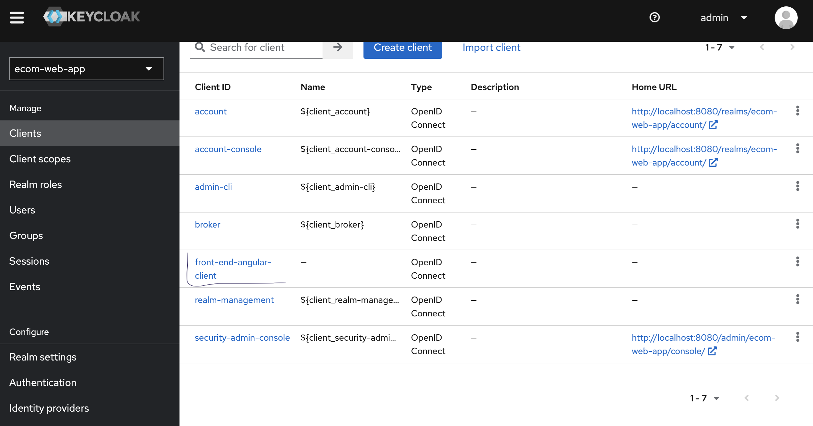
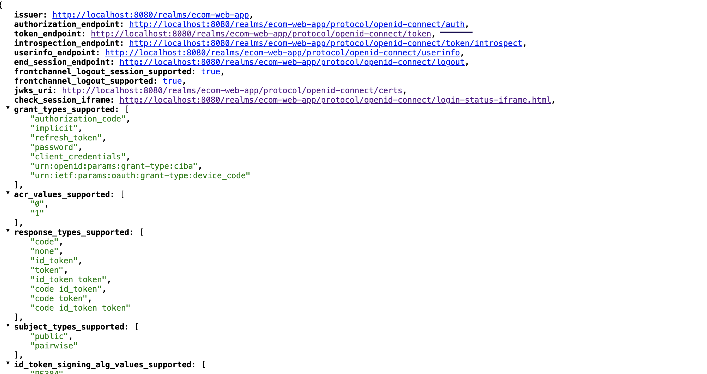
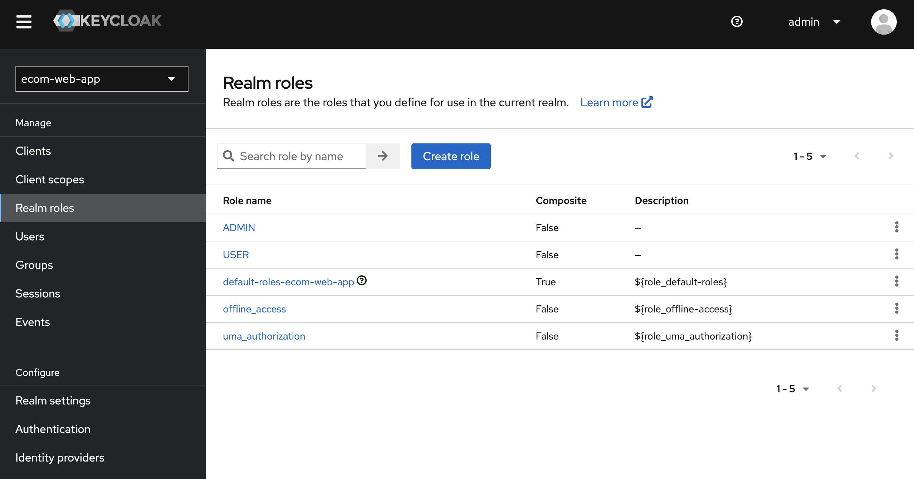
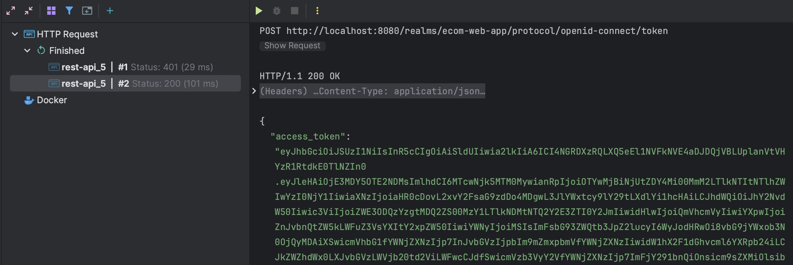
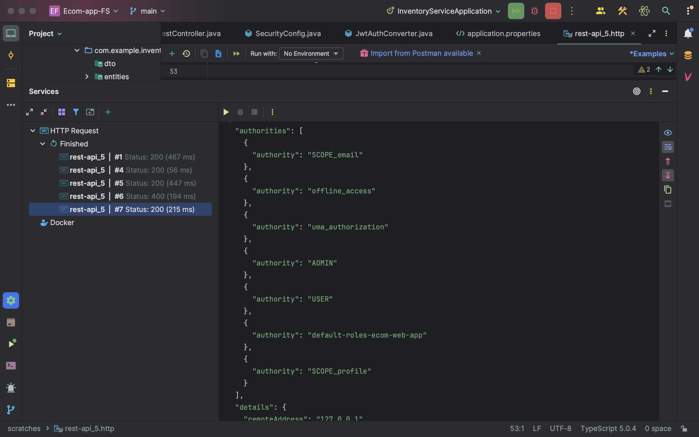
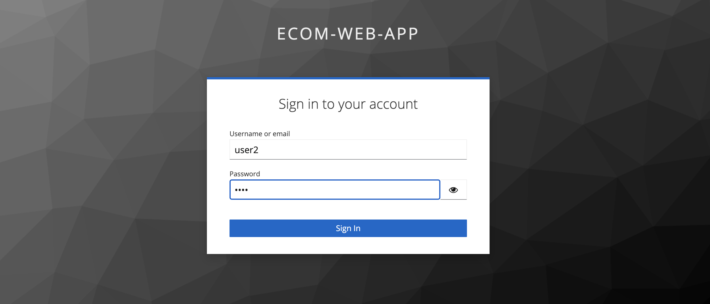
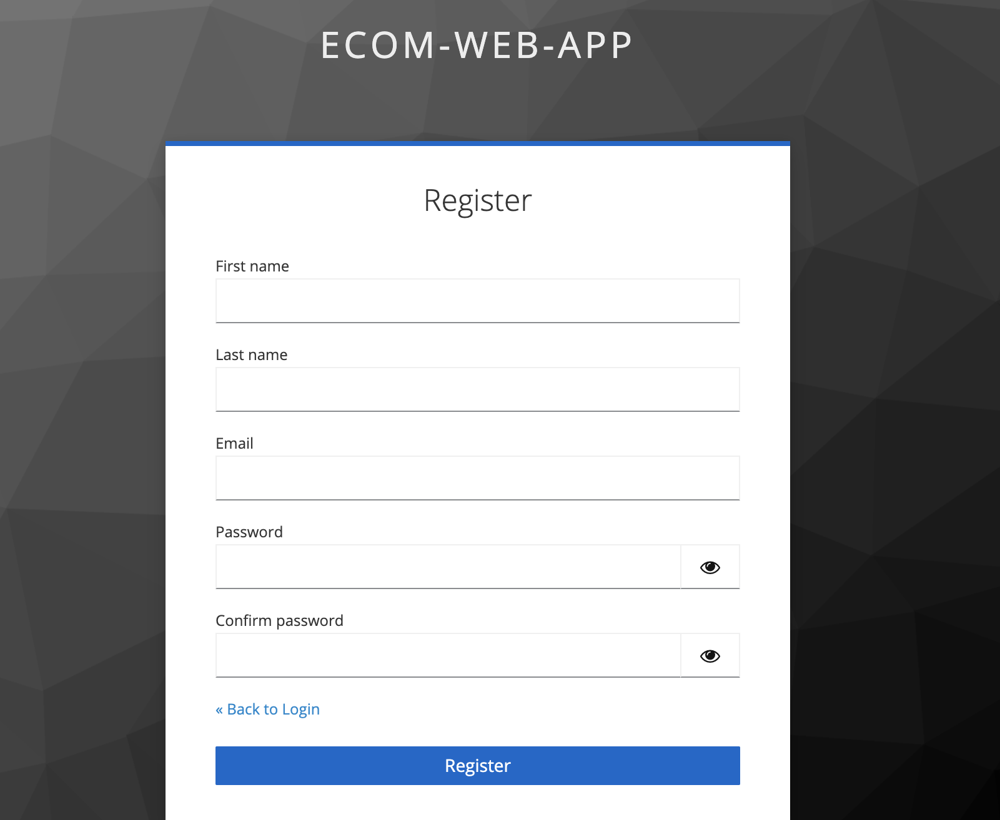
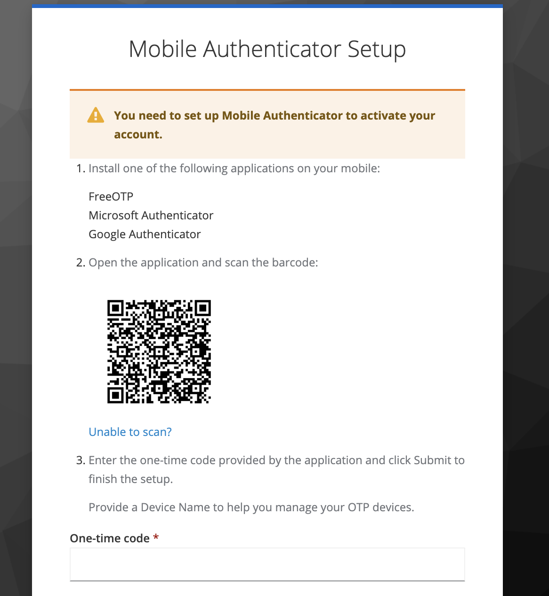
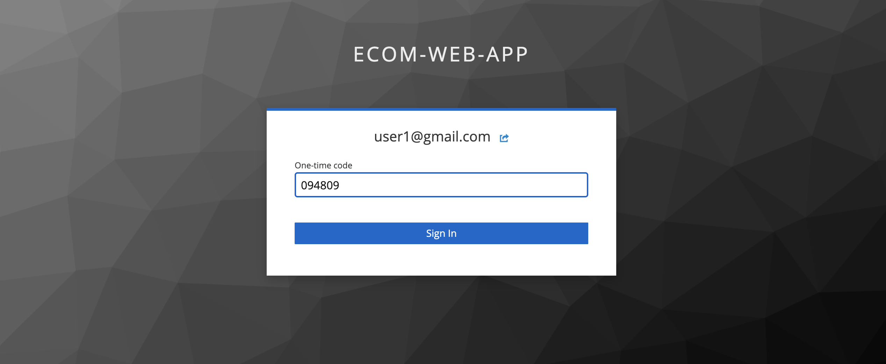
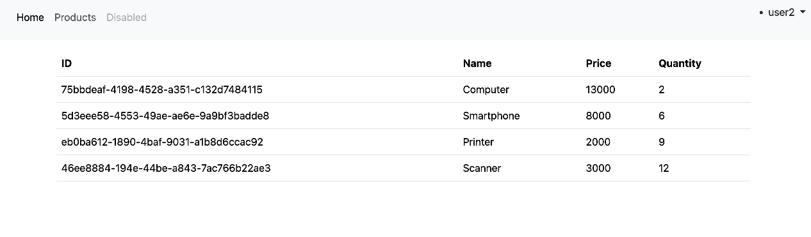

# Ecom-app

## Config Keycloak

### Client Registration

### Endpoint Configuration

### Role Configuration

### Retrieve Access Token via Client Secret

### Example of Admin Authentication

### Login with Keycloak

### Register User

## Double Authentication

### Two-Factor Authentication using Google Authenticator

### Code Obtained in Authenticator

# Access to the Application

## User Access with USER Role
For the product page, only an authenticated user with the role Admin can access.

## User with ADMIN Role

